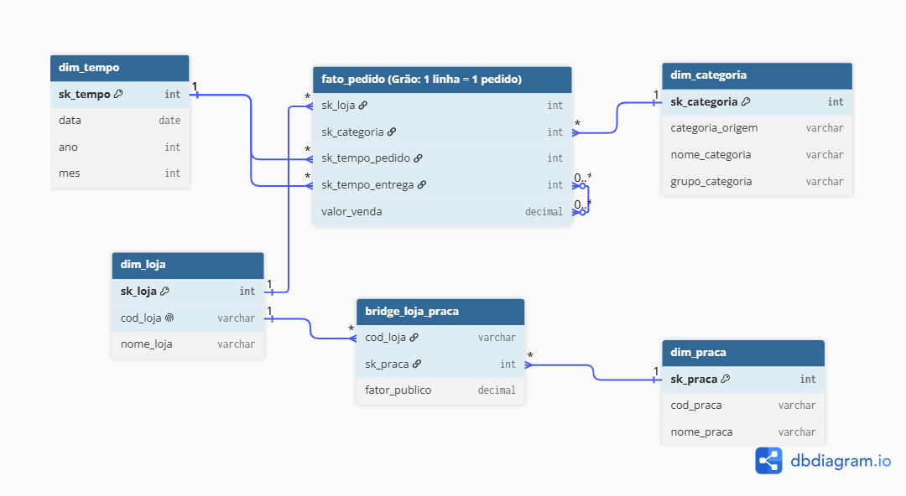

# Rede-pata-amiga-SCTEC

# 🐾 Projeto Data Warehouse - Pata Amiga (SCTEC)

Pipeline de dados e análise estratégica desenvolvida para a rede de pet shops **Pata Amiga**, integrando modelagem dimensional em PostgreSQL, scripts de extração/automação em Python e visualizações gerenciais de alto nível.

---

## 📂 Estrutura do Projeto

```text
Pata_amiga_SCTEC/
├── anexos/                   # Imagens, diagramas do modelo estrela e materiais visuais
├── desenvolvimento_projeto/  # Scripts SQL organizados por etapas do Data Warehouse
│   ├── 00-conferencia.sql
│   ├── 01-carga-staging.sql
│   ├── 02-dimensoes-prontas.sql
│   ├── 03-dimensoes.sql
│   ├── 04-fato.sql
│   └── 05-perguntas-respostas.sql
├── p5a/                      # Bloco P5a: Cruzamento de densidade de vendas, logística e população
│   ├── analise_p5a.sql
│   ├── tabela_grafico_p5a.py
│   ├── tabela_densidade_p5a.csv
│   └── grafico_barras_duplas_p5a.jpg
├── p5b/                      # Bloco P5b: Faturamento por faixa de franquia (Visão de Cadastro Atual)
│   ├── analise_p5b.sql
│   ├── tabela_grafico_p5b.py
│   ├── tabela_faturamento_franquia_p5b.csv
│   └── grafico_colunas_p5b.jpg
├── p5c/                      # Bloco P5c: Auditoria de qualidade de dados, resíduos e anomalias
│   ├── analise_p5c.sql
│   ├── tabela_grafico_p5c.py
│   ├── tabela_auditoria_residuos_p5c.csv
│   └── grafico_auditoria_residuos_p5c.jpg
├── .env                      # Variáveis de ambiente locais e credenciais (ignorado no Git)
├── .env.example              # Modelo de configuração de credenciais
├── .gitignore                # Arquivos, senhas e extensões ignorados pelo controle de versão
├── README.md                 # Documentação principal e guia do projeto
└── requirements.txt          # Dependências e bibliotecas Python do projeto
## Passo 3: Modelo Estrela


🛠️ Tecnologias e Ferramentas Utilizadas
Banco de Dados: PostgreSQL 17 / pgAdmin 4

Linguagem de Consulta: SQL padrão (compatível com restrições de projeto: sem CTEs e sem Window Functions)

Linguagem de Automação & Análise: Python (Pandas, Matplotlib, SQLAlchemy, Psycopg2)

Controle de Versão: Git e GitHub

🚀 Como Executar o Projeto
Clone o repositório:

Bash
git clone <url-do-repositorio>
cd Pata_amiga_SCTEC
Instale as dependências do Python:
Bash
pip install -r requirements.txt

As cinco perguntas de negócio:

•	P1 : Onde está o gargalo da entrega? Qual o tempo médio, em dias, entre o pedido entrar no ERP e chegar na casa do cliente? E qual dos quatro intervalos do processo  Integração → Separação, Separação → Nota, Nota → Despacho, Despacho → Entrega  é o mais lento? O gargalo é o mesmo nos três portes de loja?

•	P2 : Qual categoria concentra o faturamento? Do faturamento total da rede, quanto vem de cada categoria de produto? Agrupe pelo nome padronizado, nunca pela grafia crua, e mostre também o percentual do total. A categoria campeã é a mesma nos três portes de loja?

•	P3 : O desconto funciona igual em todo canal? Compare o ticket médio COM e SEM desconto dentro de cada canal de venda (App, Site, Loja Física, Telefone, WhatsApp). Se o desconto derruba o ticket em um canal e não em outro, a política não deveria ser a mesma nos dois. Diga também quanto cada canal representa do faturamento.

•	P4 : Qual praça de atendimento concentra o faturamento? Atenção: uma loja entrega em mais de uma praça. O rateio precisa ser feito pelo percentual do público, e a soma por praça tem de fechar com o faturamento da rede. Cruze o faturamento rateado com o número de domicílios com pet de cada praça.

•	P5 : Onde abrir a próxima loja, e o que os dados NÃO permitem afirmar? 
a.	Ranqueie as lojas por itens vendidos por mil habitantes da cidade  não em valor absoluto  e cruze com o tempo médio de entrega. 
b.	A faixa de franquia no cadastro é a de hoje: o passado foi sobrescrito. Mostre o faturamento por faixa ATUAL e explique por que isso não responde “quanto veio de lojas que JÁ ERAM Ouro na data do pedido”.
c.	Meça o que ficou de fora: pedidos sem loja identificada, entregas ainda não concluídas, itens e valores em branco.
## Decisões de Modelagem e Limpeza (Passos 1 a 3)

Para garantir a qualidade dos dados e o correto funcionamento do modelo dimensional, as seguintes decisões técnicas foram aplicadas na construção das dimensões:

* **Garantia de Integridade Referencial (Tratamento de Nulos):** Antes de qualquer carga de dados, inserimos a linha `-1` (Não Informado) em todas as dimensões (`dim_categoria`, `dim_praca`, etc.). Isso previne falhas de JOIN na tabela fato quando a origem apresentar dados em branco ou nulos.
* **Regras de Negócio na dim_categoria:** Havia o risco de ambiguidade na classificação (ex: "Ração Medicamentosa"). Para resolver, estruturamos o `CASE WHEN` testando a string "MED" rigorosamente antes de "RA". Além disso, mantivemos a coluna `categoria_origem` com a grafia crua exata para viabilizar o cruzamento futuro com a *staging area*.
* **Estrutura Snowflake e Tabela Ponte:** A relação muitos-para-muitos entre Lojas e Praças foi resolvida através da `bridge_loja_praca`. 
* **Tipagem de Dados:** Durante a carga da praça e da ponte, tratamos as strings numéricas, removendo pontos de milhar em `domicilios_com_pet` para conversão em `INT` e trocando vírgulas por pontos no `fator_publico` para conversão em `DECIMAL(6,4)`.
--------------------------------------------
