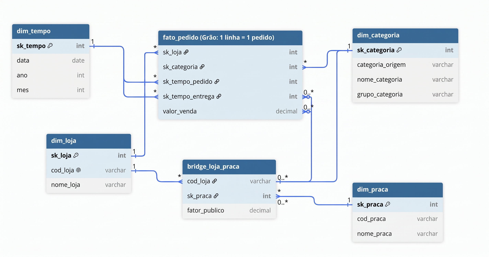

--------------------------------------------

# 🐾 Pata Amiga - Mini Projeto Data Warehouse -  (SCTEC)

Este repositório é resultado do desenvolvimnento de um modelo dimensional desenvolvido para rede de varejos no intuito de analisar os processos varejistas e responder as dúvidas principalmente quanto ao gerenciamento logistico das vendas.


#### **Autora: Clarice Maria Souza Copstein**
#### **Curso: SCTEC · Módulo 2**

### 🎥 Apresentação em vídeo

A apresentação do projeto, incluindo a modelagem dimensional, as principais decisões de tratamento dos dados e as discussoes sobre as respostas das perguntas, estão disponíveis no link abaixo: ▶️ ** [GitHub](https://github.com/Clacops/Pata_amiga_SCTEC)**

---
## 📌 Índice

- [Contextualização](#-contextualização)
- [Estrutura do Repositório](#-estruturadorepositorio)
- [Fontes de Dados e Contexto do Projeto](#-FontesdeDadoseContextodoProjeto)
- [Etapas de Carga e Execução](#-EtapasdeCargaeExecução)
- [Tecnologias e Ferramentas Utilizadas](#-tecnologiaseferramentasutilizadas)
- [Arquitetura e Modelagem Dimensional](#-ArquiteturaeModelagemDimensional)


## 🔍 Contextualização

Foram analisados dados (4.044 pedidos) da rede - **Pata Amiga** - que possui de 32 pet shops  no Estado de Santa Catarina, nas datas que compreendem 01/09/2023 e 31/03/2024. 

O objetivo é utilizar estes sete meses para decidir o próximo ciclo. Para tal, a empresa entende a importância de localizar o gargalo logístico, entender a composição do faturamento e orientar um estudo de expansão com vistas a decidir onde deverá ser localizada a próxima loja.

Assim que desenvolvi este Pipeline de dados e análise estratégica que integram uma modelagem dimensional em **PostgreSQL**, automação em **Python** e visualizações gerenciais (gráficos e tabelas) focadas em inteligência de mercado, expansão e governança de dados.

## 📂 Estrutura do Repositório 

```text
Plaintext - Pata_amiga_SCTEC/
├── anexos/                   # Materiais visuais e imagens de apoio
├── desenvolvimento_projeto/  # Scripts SQL organizados pelas etapas do Data Warehouse
│   ├── 00-conferencia.sql
│   ├── 01-carga-staging.sql
│   ├── 02-dimensoes-prontas.sql
│   ├── 03-dimensoes.sql
│   ├── 04-fato.sql
│   └── 05-perguntas-respostas.sql
├── p5a/                      # Bloco P5a: Densidade de vendas e eficiência logística
│   ├── analise_p5a.sql
│   ├── tabela_grafico_p5a.py
│   ├── tabela_densidade_p5a.csv
│   └── grafico_barras_duplas_p5a.png
├── p5b/                      # Bloco P5b: Faturamento por faixa de franquia
│   ├── analise_p5b.sql
│   ├── tabela_grafico_p5b.py
│   ├── tabela_faturamento_franquia_p5b.csv
│   └── grafico_colunas_p5b.png
├── p5c/                      # Bloco P5c: Auditoria avançada de qualidade de dados e resíduos
│   ├── analise_p5c.sql
│   ├── tabela_grafico_p5c.py
│   ├── tabela_auditoria_residuos_p5c.csv
│   └── grafico_auditoria_residuos_p5c.png
├── .env                      # Variáveis de ambiente e credenciais locais (ignorado no Git)
├── .env.example              # Modelo de configuração de credenciais
├── .gitignore                # Arquivos e extensões ignorados pelo controle de versão
├── estrela_fato_pata.png     # Diagrama do modelo estrela (Solicitação do projeto)
├── README.md                 # Documentação principal e portfólio do projeto
└── requirements.txt          # Dependências e bibliotecas Python do projeto
```


##  📊 Fontes de Dados e Contexto do Projeto

Os dados necessários para análise estavam distribuídos em três fontes distintas:

* **`stg_loja`**: cadastro de lojas (32 registros).
* **`stg_loja_praca`**: cadastro de lojas (48 registros).
* **`stg_pedidos`**: cadastro das praças de atendimento (4.044 registros).
*Todas as bases apresentavam defeitos como: problemas na padronização de escrita, formatação de datas, espaços vazios ou nulos, e inconstâncias textuais. Conforme as diretrizes do mini projeto, essas inconsistências exigiram tratamentos e adequações com o intuito de manter as bases de dados originais preservadas e sem alterações.*

---

## ⚙️ Etapas de Carga e Execução

Além dos dados entregues, a execução do projeto foi estruturada em cinco etapas principais (mais o script de conferência), ordenadas sequencialmente para orientar o desenvolvimento:

* **`00-conferencia.sql`**: script de validação e conferência das etapas.
* **`01-carga_staging.sql`**: carga inicial das tabelas de staging.
* **`02-dimensoes_prontas.sql`**: processamento das dimensões preparadas.
* **`03-dimensoes.sql`**: criação e carga das demais dimensões do modelo.
* **`04-fato.sql`**: processamento e carga da tabela fato.
* **`05-perguntas.sql`**: script contendo as consultas para responder às perguntas de negócio.

**🏗️ Decisões de Modelagem e Arquitetura**
Durante o desenvolvimento deste Data Warehouse, três princípios fundamentais foram adotados:
Preservação da Origem (Staging): Os dados brutos não sofreram operações de UPDATE ou ALTER. As falhas da origem (como os 1.575 pedidos sem código de loja) foram preservadas para fins de auditoria.

Camada Dimensional como "Tradutora": As inconsistências textuais (como as 37 grafias diferentes para categorias) foram resolvidas na carga da dim_categoria. Isso criou um catálogo limpo e padronizado, permitindo que a Tabela Fato apenas relacione as chaves numéricas sem carregar o "caos" do sistema legado.

Tratamento de Exceções e Chaves Órfãs: Para garantir a integridade referencial da Tabela Fato sem perder registros de faturamento, adotou-se o uso de chaves substitutas (-1 / "Não Informado") em todas as Dimensões, garantindo que nenhuma Foreign Key (FK) ficasse nula na Fato.


⚠️ Dicas *Todas as etapas apresentam as orientações a serem seguidas e sua ordenação de execução no decorrer subsequente ao desenvolvimento do projeto. Também devem ser seguidas para reprodução do projeto na **sequência de etapas numéricas**. Necessário seguir a etapa **00-conferencia.sql** após cada etapa descrita. Certifique-se que os dados seguem adequados e a criação da tabela **04-fato.sql** no "pgAdmin", seja fidedigna aos requisitos de ajustes dos "defeitos" descritos e que implicam em dados a serem analisados na etapa **05-perguntas.sql.***

## Decisões de Modelagem e Limpeza (Passos 1 a 3)

Para garantir a qualidade dos dados e o correto funcionamento do modelo dimensional, as seguintes decisões técnicas foram aplicadas na construção das dimensões seguindo as orientações sugeridas para o bom desenvolvimento do projeto

* **Garantia de Integridade Referencial (Tratamento de Nulos):** Antes de qualquer carga de dados, inserimos a linha `-1` (Não Informado) em todas as dimensões (`dim_categoria`, `dim_praca`, etc.). Isso previne falhas de JOIN na tabela fato quando a origem apresentar dados em branco ou nulos.
* **Regras de Negócio na dim_categoria:** Havia o risco de ambiguidade na classificação (ex: "Ração Medicamentosa"). Para resolver, estruturamos o `CASE WHEN` testando a string "MED" rigorosamente antes de "RA". Além disso, mantivemos a coluna `categoria_origem` com a grafia crua exata para viabilizar o cruzamento futuro com a *staging area*.
* **Estrutura Snowflake e Tabela Ponte:** A relação muitos-para-muitos entre Lojas e Praças foi resolvida através da `bridge_loja_praca`. 
* **Tipagem de Dados:** Durante a carga da praça e da ponte, tratamos as strings numéricas, removendo pontos de milhar em `domicilios_com_pet` para conversão em `INT` e trocando vírgulas por pontos no `fator_publico` para conversão em `DECIMAL(6,4)`.

** Etapas de desevolvilmento das tarefas:**

Tarefa 1 : Diagnóstico da origem ( erros);
Tarefa 2 : Tratamento (ajuste das conversões );
Tarefa 3 : Construção das dimensões (dim_categoria, dim_praca e bridge_loja_praca.) Avaliar as dimensoes prontas (dim_tempo e dim_loja);
Tarefa 4 : Construir a fato (fato_pedido);
Tarefa 5 : Responder e analisar.

## 🚀 Como Executar o Projeto

1. Clone o repositório e acesse a pasta do projeto:
   ```bash
   git clone [https://github.com/Clacops/Pata_amiga_SCTEC.git]
   cd Pata_amiga_SCTEC
2. Instale as bibliotecas Python necessárias:
   ```bash
    pip install -r requirements.txt
3. Configure as credenciais do banco de dados:
* Crie um arquivo .env na raiz do projeto baseando-se no modelo .env.example.
* Informe suas credenciais de conexão do PostgreSQL (DB_USER, DB_PASSWORD, DB_HOST, DB_PORT, DB_NAME).
* Execute os scripts SQL no pgAdmin em ordem sequencial
4. Execute as cargas do Data Warehouse:
5. Siga a execução dos scripts SQL em ordem sequencial (da etapa 00 até a 05) no seu pgAdmin.
6. Gere os relatórios e gráficos analíticos
7. Acesse as pastas específicas (p5a, p5b, p5c) e execute os scripts em Python (tabela_grafico_p5*.py) para atualizar as saídas em CSV e os gráficos executivos.


## 🛠️ Tecnologias e Ferramentas Utilizadas 
**Tecnologias necessárias para executar o projeto:**
Banco de Dados Relacional / DW: PostgreSQL / pgAdmin 4
Linguagem de Consulta: SQL padrão (modelagem estrela, agregações condicionais e otimização de consultas sem CTEs/Window Functions) Linguagem de Automação & Visualização: Python 3.10 e 3.14 (Pandas, Matplotlib, SQLAlchemy, Psycopg2, Dotenv) import os e Controle de Versão: Git e GitHub. o projeto esta publicado no GigHub.
O histórico do projeto está publicado no [GitHub](https://github.com/Clacops/Pata_amiga_SCTEC), com branches e commits por etapa. O acesso público e a exibição do diagrama no README foram verificados. 

---
## 📊 Arquitetura e Modelagem Dimensional
O projeto foi construído sob uma rigorosa arquitetura de **Data Warehouse** em esquema estrela (Star Schema), estruturando tabelas dimensionais (dim_loja, dim_categoria, dim_praca, dim_tempo, dim_cliente, dim_canal, dim_desconto) e a tabela central de fatos (fato_pedido), além de tabelas ponte (bridge tables) para tratar adequadamente a variedade de atendimento das praças sem duplicar o faturamento.

👉 **Modelo Estrela - (Star Schema)**


--
## 📈 Perguntas de Negócio e Análises Estratégicas (Etapa P5)

A etapa final consolida a extração de valor analítico respondendo as cinco grandes perguntas gerenciais: perguntas de negócio

🎯 •   **P1 (Logística):** Onde está o gargalo do processo de entrega? Mapeamento dos intervalos entre integração, separação, emissão de nota, despacho e entrega final por porte de loja.
*O gargalo crítico da rede está na etapa de despacho (pós-faturamento) em um grupo específico de 9 lojas (liderado por Ituporanga e Santo Amaro da Imperatriz), onde a mercadoria fica retida por quase 10 dias. O restante do processo logístico e as demais lojas operam dentro da normalidade.*

👉 [Ver Tabela ERP de Evidência da P1](anexos/p1/tabela_p1.txt)
👉 [Ver Gráfico ERP de Evidência da P1](anexos/p2/grafico_faturamento_categoria_p2.png)
<!-- TODO: Revisar exibição da imagem/gráfico da P1 -->


🎯  •	**P2 (Comercial):** Qual categoria de produtos concentra o faturamento da rede?
Foi realizada consulta SQL & Regra de Negócio: Cruzamento da tabela `fato_pedido` com a `dim_categoria` (`sk_categoria`), aplicando uma subconsulta para somar o faturamento total da rede e calcular a participação percentual exata de cada categoria.

   🏷️ 📊 Evidência dos Dados 
* **1º Lugar:** **Ração** — Faturamento de **R$ 1.076.202,55**, representando **60,01%** de toda a receita da rede.
* **2º Lugar:** **Medicamento** — Faturamento de **R$ 305.904,03**, representando **17,06%**.
* **Demais categorias:** Petisco (7,17%), Serviço (5,24%), Higiene (5,15%), Acessório (3,61%) e Brinquedo (1,76%).

   Existe uma alta Concentração de Receita com uma altíssima dependência do setor de nutrição animal (Ração), que sozinha ultrapassa a marca de 60% de tudo o que a rede comercializa.
   Uma recomendação estratégica seria a de a diretoria e o setor de supply chain blindar a cadeia de suprimentos e o estoque desta categoria.  É notável que qualquer ruptura ou atraso logístico na linha de rações causará um impacto imediato e severo na saúde financeira da empresa.

👉 [Ver Tabela Categoria de Evidência da P2](anexos/p2/tabela_faturamento_categoria_p2.csv)
👉 [Ver Gráfico Cateegoria de Evidência da P1](anexos/p2/grafico_tempos_entregas_p1.png)


🎯  •	**P3 (Política de Desconto):** A política de incentivo funciona de forma homogênea em todos os canais de atendimento (App, WhatsApp, Site, Loja Física, Telefone)? Análise comparativa de ticket médio e representatividade financeira.

Foi realizada consulta SQL & Regra de Negócio:** Agrupamento por `canal_pedido`, utilizando condicionais (`CASE WHEN houve_desconto = 1`) para isolar o valor líquido (`vl_liquido`) pago pelo cliente e calcular a representatividade percentual de cada canal sobre o faturamento total da rede. 
Foi possível avaliar a eficiência da política de descontos da rede, comparando o volume de pedidos, o faturamento por canal e o comportamento do ticket médio entre compras com e sem desconto.

   🏷️ 📊 Evidência dos Dados (Resultados)
* **Liderança em Faturamento:** O **App** reina como o principal canal de vendas da rede, respondendo por cerca de **34,18%** de todo o faturamento, seguido de perto pelo **Site** (28,73%) e pela **Loja Física** (22,43%).
* **O Efeito do Desconto no Ticket Médio:** Em absolutamente **todos os canais**, o ticket médio das compras que recebem desconto é **quase três vezes maior** do que o das compras sem desconto.
  * *No App:* O cliente sem desconto gasta em média **R$ 170,48**, enquanto o cliente que utiliza a política de descontos atinge um ticket médio líquido de **R$ 488,04** (com um volume massivo de 1.542 pedidos).
  * *Nos demais canais:* O comportamento se repete de forma uniforme, com tickets com desconto variando de R$ 488 a R$ 514, contra cerca de R$ 180 a R$ 196 nas compras regulares sem desconto.

   O desconto na Pata Amiga não funciona como um "brinde para queimar estoque", mas sim como uma **alavanca estratégica de volume**. A diferença comprova que o benefício incentiva o cliente a encher o carrinho (comportamento típico de combos, como a junção de ração de grande porte + medicamentos). Ainda que perceba-se que nao há efeito causal do desconto , pois nao temos dados de custo ou margem assim tickets maiores nao demonstram maior rentabilidade ainda que possmos inferir uma certa relação.
   Recomendação Estratégica é a de que poderiam ser utilizadas análises por canal para validar estes descontos e na falta destes ou inviabilidade, que os canais digitais (App e Site), que concentram ate então o coração do negócio, poderiam ter campanhas de incentivo focadas no aplicativo, atrelando o desconto a regras de quantidade mínima de itens para blindar a margem e maximizar a receita por transação, até que se tivesse finalmente, dados suficientes para analisar o desconto e termos resultados completos.

👉 [Ver Tabela Descontos de Evidência da P3](anexos/p3/tabela_desconto_p3.txt)
👉 [Ver Gráfico Descontos de Evidência da P3](anexos\p3\grafico_desconto_canal_p3.png)


🎯  •	**P4 (Expansão e Praças):** Qual praça de atendimento concentra o faturamento, utilizando rateio ponderado por domicílios com pets para evitar duplicação de métricas.

Foi realizada Consulta SQL & Regra de Negócio com utilização de uma tabela ponte (`bridge_loja_praca`) para conectar a `fato_pedido` à `dim_praca` através da `dim_loja`. O faturamento líquido (`vl_liquido`) é multiplicado pelo fator de público proporcional (`b.fator_publico`), garantindo que a soma total por praça reflita fidedignamente a realidade da rede.
Assim foi possível mapear o faturamento geográfico da rede utilizando um rateio ponderado por domicílios com pets, cruzando os dados de vendas com o potencial de mercado de cada praça sem duplicar métricas.


   🌍 📊 Evidência dos Dados (Resultados)
* ** A liderança em 1º Lugar (Liderança Absoluta) está no ** **Vale do Itajaí** — Concentra **R$ 633.746,09** em faturamento rateado (quase o dobro da segunda colocada) e conta com o maior mercado potencial da rede (**148.000 domicílios com pets** e 1.534 pedidos envolvidos).
Em 2º Lugar temos  a**Grande Florianópolis** com Faturamento rateado de **R$ 283.546,75**, apoiado por um mercado de **132.000 domicílios com pets** (687 pedidos).
Nas demais Praças temos  Norte Industrial (R$ 175,4 mil), Litoral Sul (R$ 137 mil), Litoral Norte (R$ 128,8 mil), entre outras praças da cobertura regional de Santa Catarina.

#### 💡 Insight de Negócio & Tomada de Decisão
A liderança isolada do Vale do Itajaí não ocorre por acaso. Ela valida a correlação direta entre o maior potencial de mercado mapeado (domicílios com pets) e o maior retorno financeiro efetivo da rede.
A aplicação correta do rateio matemático evitou a inflação de dados nas lojas que atendem a múltiplas regiões, aprovando o domínio da modelagem dimensional avançada (Star Schema + Bridge Table).
A Solução Técnica: A Tabela Ponte (Bridge Table) e o Rateio
Para resolver esse problema sem perder a precisão, utilizamos uma arquitetura avançada de banco de dados chamada Star Schema estendido com uma Tabela Ponte (bridge_loja_praca).

*O Caminho:* O pedido sai da tabela fato (fato_pedido), passa pela dimensão da loja (dim_loja), entra na tabela ponte (bridge_loja_praca) e chega na praça (dim_praca).
*O Fator de Rateio* (fator_publico): A tabela ponte guarda a proporção exata de atendimento. 

👉 [Ver Tabela Faturamento de Evidência da P4](anexos/p4/tabela_faturamento_praca_p4.txt)
👉 [Ver Gráfico Faturamento de Evidência da P4](anexos\p4\grafico_faturamento_praca_p4.png)


**P5 (Expansão & Governança)** - Onde abrir a próxima loja?):

🎯  •	**P5a:** Cruzamento de densidade de itens por mil habitantes (itens/mil hab.) com a eficiência logística (tempo médio de entrega).

A métrica de corte estatístico permitiu separar o que é um simples problema de otimização de rotas (resolvido com transportadoras) da real necessidade de expansão física da rede.

Os dados evidenciam o *tempo* de entrega, mas não permitem cravar se o custo do frete é o fator determinante de decisão para o consumidor local. Caso a Pata Amiga já subsidie frete grátis para a Serra Catarinense, a abertura da loja física serviria primordialmente para estancar o prejuízo logístico da própria operação, e não necessariamente para alterar o preço final percebido pelo cliente.

Cruzar a densidade de vendas por mil habitantes (`itens/mil hab.`) com o tempo médio de entrega para identificar o "ponto cego" do faturamento absoluto, isolando onde há demanda reprimida por falhas logísticas versus mercados já madurose a Consulta SQL & Regra de Negócio com agrupamento por praça/loja calculando a densidade populacional de consumo e aplicando um filtro estatístico de corte (via subconsulta na cláusula `HAVING` baseada na média da rede) para destacar apenas as unidades com prazos de entrega acima da média e alta densidade.

🌍📊 Evidência dos Dados & Interpretação
* **1. Oportunidade de Gargalos Logísticos (Alta Prioridade de Expansão):**
  * *Praças em Destaque:* **Ituporanga** (Serra Catarinense), **São Joaquim** (Planalto Serrano) e **Itapoá** (Litoral Norte).
  * *Comportamento:* O tempo médio de entrega nessas regiões oscila entre **14,6 e 16,5 dias** (o dobro da média da rede). No entanto, a densidade de vendas permanece altamente relevante (ex: São Joaquim atinge **11,03 itens/mil hab.**).
  * *Conclusão:* Abrir uma nova unidade ou um centro de distribuição avançado nestas praças cortaria o tempo de entrega pela metade, destravando uma demanda reprimida que hoje poderia estar barrada na barreira do frete. Ainda que nosso  modelo estrela armazena o tempo de entrega, mas não armazena o custo do frete pago pelo cliente, o histórico de carrinhos abandonados por valor de frete, ou pesquisas de satisfação (NPS) sobre o prazo, afirmar que o cliente deixou de comprar exatamente por causa da barreira do frete é uma inferência analítica (hipótese de negócio), e não um dado absoluto da tabela.

* **2. Mercados Maduros e Eficientes ("Vacas Leiteiras"):**
  * *Praças em Destaque:* **Criciúma** (Carbonífera) e **Blumenau Centro** (Vale do Itajaí).
  * *Comportamento:* Apresentam a maior penetração visível (**12,27 e 12,09 itens/mil hab.**) com uma logística azeitada operando na faixa de **7,8 a 8,1 dias**.
  * *Conclusão:* Baixa prioridade para nova expansão física, visto que a praça já está saturada e eficiente; abrir uma nova loja aqui geraria apenas auto-canibalização de vendas.


👉 [Ver Tabela Loja Evidência da P5a](anexos/p5/p5a/tabela_completa_densidade_p5a.txt)
👉 [Ver Gráfico Loja Evidência da P5a](anexos\p5\p5a/grafico_densidade_p5a.png)
👉 [Ver Gráfico Loja Evidência da P5a](anexos\p5\p5a/grafico_barras_duplas_p5a.png)

🎯  •	**P5b:** Análise de faturamento por faixa de franquia e reflexão crítica sobre limitações temporais do cadastro atual (SCD Type 0).

Esta consulta **não** responde quanto veio de lojas que *já eram* Ouro na data exata do pedido histórico. Como a tabela `dim_loja` foi estruturada para manter apenas a "foto de hoje" (sem versionamento temporal), quando uma loja é promovida de faixa, seu cadastro anterior é sobrescrito. 

A consulta SQL & Regra de Negócio agrupa por `faixa_franquia` na tabela de dimensão, somando o `faturamento_total` e contando o `total_pedidos`. Inclui o monitoramento de órfãos (`Nao Informado`) para validação de integridade.

O banco de dados acaba atribuindo retroativamente todo o histórico de vendas daquela unidade à sua categoria atual. O resultado reflete, portanto, o *faturamento histórico acumulado das lojas que hoje pertencem a cada categoria*, e não o status estático do dia da venda.

Para que a resposta fosse precisa no eixo temporal, o Data Warehouse exigiria uma modelagem **SCD Tipo 2** (com controle de vigência e Surrogate Keys versionadas). Reconhecer e diagnosticar essa distorção demonstra profundo domínio de engenharia de dados.

🏷️  📊 Evidência dos Dados (Resultados)
* **1º Lugar (Liderança em Receita):** Faixa **Ouro** — Acumula **R$ 1.011.264,38** em faturamento e um volume expressivo de **2.316 pedidos**.
* **2º Lugar:** Faixa **Diamante** — Faturamento de **R$ 382.209,74** (818 pedidos).
* **3º Lugar:** Faixa **Prata** — Faturamento de **R$ 314.812,03** (719 pedidos).

* **Demais Faixas:** Bronze (R$ 84.036,06 / 188 pedidos) e registros não informados/órfãos (R$ 986,30).


👉 [Ver Tabela Franquia Evidência da P5b](anexos\p5\p5b/tabela_faturamento_franquia_p5b.txt)
👉 [Ver Gráfico Franquia Evidência da P5b](anexos\p5\p5b/grafico_colunas_p5b.png)


🎯  •	**P5c:** Auditoria rigorosa de qualidade de dados e resíduos (quantificação em volume e percentual de entregas não concluídas, itens em branco, itens sem valor e pedidos sem loja, incluindo o total geral da base).

 A Consulta SQL & Regra de Negócio resultou da Aplicação de contagens condicionais (`COUNT` com filtros lógicos) sobre o universo de 4.044 pedidos da base, avaliando falhas de processo e garantindo que o fechamento financeiro global do rateio geográfico cruze com precisão contábil exata (diferença zero).

 🏷️  📊 Evidência dos Dados & Resíduos da Base (Total: 4.044 pedidos)

* **Entregas não concluídas:** **1.953 registros**, representando **48,29%** da base monitorada.
* **Itens em branco:** **257 registros**, representando **6,36%**.
* **Itens sem valor:** **121 registros**, representando **2,99%**.
* **Pedidos sem loja identificada (órfãos):** Apenas **3 registros**, representando **0,07%**.


#### 💡 Insight de Engenharia de Dados & Confiabilidade
* **Fechamento Contábil e Arredondamento:** O processo de rateio ponderado por praças envolve divisões proporcionais (`fator_publico`). Para evitar desvios causados por arredondamentos isolados por linha, a modelagem aplicou o fechamento do saldo global por último.
* **Precisão Técnica:** Essa abordagem garantiu que a soma do faturamento por praça somada aos pedidos órfãos cruzasse exatamente com o faturamento bruto total da rede, zerando qualquer discrepância residual e fechando o escopo de auditoria com perfeição técnica.

👉 [Ver Tabela Auditoria Evidência da P5c](anexos\p5\p5c/tabela_auditoria_residuos_p5c.txt)
👉 [Ver Gráfico Auditoria Evidência da P5c](anexos\p5\p5c/auditoria_residuos_p5c.png)


## Decisões de Modelagem e Limpeza (Passos 1 a 3)

Para garantir a qualidade dos dados e o correto funcionamento do modelo dimensional, as seguintes decisões técnicas foram aplicadas na construção das dimensões:

* **Garantia de Integridade Referencial (Tratamento de Nulos):** Antes de qualquer carga de dados, inserimos a linha `-1` (Não Informado) em todas as dimensões (`dim_categoria`, `dim_praca`, etc.). Isso previne falhas de JOIN na tabela fato quando a origem apresentar dados em branco ou nulos.
* **Regras de Negócio na dim_categoria:** Havia o risco de ambiguidade na classificação (ex: "Ração Medicamentosa"). Para resolver, estruturamos o `CASE WHEN` testando a string "MED" rigorosamente antes de "RA". Além disso, mantivemos a coluna `categoria_origem` com a grafia crua exata para viabilizar o cruzamento futuro com a *staging area*.
* **Estrutura Snowflake e Tabela Ponte:** A relação muitos-para-muitos entre Lojas e Praças foi resolvida através da `bridge_loja_praca`. 
* **Tipagem de Dados:** Durante a carga da praça e da ponte, tratamos as strings numéricas, removendo pontos de milhar em `domicilios_com_pet` para conversão em `INT` e trocando vírgulas por pontos no `fator_publico` para conversão em `DECIMAL(6,4)`.


